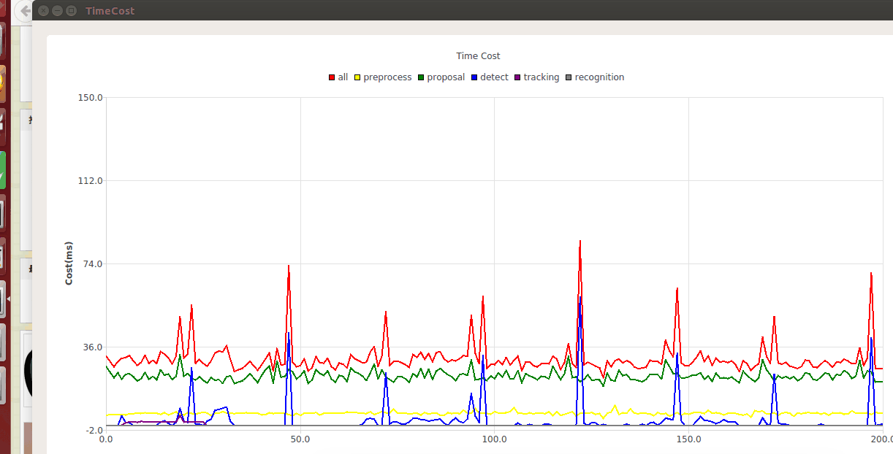

# Dynamic time cost visualization tool



It is based on [QtChart from Qt5.7](http://doc.qt.io/qt-5/qtcharts-index.html). You can find easily which part of your code runs slowly.

## Build
1. git clone https://github.com/DuinoDu/time_cost_visualization
2. use Qt Creator to build it. You should use Qt5.7
3. Add following code snippets to your project, in order to get data and send to visuatlization tool.

```
#include <boost/asio.hpp>
#include <boost/array.hpp>
#include <boost/thread/thread.hpp>
using boost::asio::ip::tcp;

class SocketSender
{
public:
    SocketSender();
    ~SocketSender();
    bool blockSend(const string& msg);

private:
    boost::asio::io_service io;
    tcp::acceptor *acceptor;
    int comm = 3200;
};

```
```
#include "socketsender.h"
SocketSender::SocketSender()
{
    acceptor = new tcp::acceptor(io, tcp::endpoint(tcp::v4(), comm));
}

SocketSender::~SocketSender()
{
    delete acceptor;
}

bool SocketSender::blockSend(const string &msg)
{
    try{
        tcp::socket socket(io);
        acceptor->accept(socket);

        std::string message = msg;
        boost::system::error_code ec;
        socket.write_some(boost::asio::buffer(message), ec);
        return true;
    }
    catch(exception& e){
        cerr << e.what() << endl;
        return false;
    }
}
```

In your code:

```
#ifdef debug_time
    socketsender sender;
#endif

...

#ifdef DEBUG_TIME
    sender.blockSend(timer.toString());
#endif

```
_timer_ is a class responsible for recording time.
